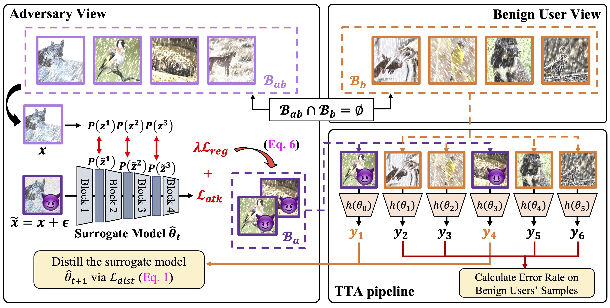

<div align="center" style='position: relative;'>

<h1>On the Adversarial Risk of Test Time Adaptation: An Investigation into Realistic Test-Time Data Poisoning</h1>
<a href='https://yysu.site/'>Yongyi Su</a>,&nbsp;
<a href='https://yushu-li.github.io/'>Yushu Li</a>,&nbsp;
<a href='https://scholar.google.com/citations?user=x3dCJrAAAAAJ'>Nanqing Liu</a>,&nbsp;
<a href='http://kuijia.site/'>Kui Jia</a>,&nbsp;
<a href='https://scholar.google.com.sg/citations?user=tXkwIK8AAAAJ'>Xulei Yang</a>,&nbsp;
<a href='https://scholar.google.com/citations?user=AgbeqGkAAAAJ'>Chuan-Sheng Foo</a>,&nbsp;
<a href='https://scholar.google.com/citations?user=pi0SGQUAAAAJ'>Xun Xu</a>
<div style='height:10px'></div>
<a href='https://arxiv.org/abs/2410.04682'></a> 
</div>

## 🎈 News

- [2025.1.23] Our work has been accepted to ICLR 2025 [(OpenReview)](https://openreview.net/forum?id=7893vsQenk) 🎉
- [2025.2.24] The whole implementation code is released 🔓

## 🚀 Introduction

<div align="center">

</div>

Illustration of the proposed Realistic Test-Time Data Poisoning (RTTDP) pipeline. In order to explore more realistical adversarial risk of Test-Time Adaptation (TTA), we restrict the attacker to the following three points:

1. **Gray-box Attack**: The attacker has to perform a gray-box attack, i.e., the attacker can only access the pre-trained model's parameters $\theta_0$ but not the online TTA model's parameters $\theta_t$.
2. **No Access to Other Users' Benign Samples**: The attacker must not access the benign samples from other users during generating poisoned samples.
3. **Online Attack Order**: The poisoned samples should be mixed into the TTA test data stream with other normal samples, rather than being injected into the TTA stream before other users' samples.

The Adversarial Risk of TTA is estimated by calculating the error rate of **other users' benign samples**.

The comparison between RTTDP and existing Test-Time Data Poisoning (TTDP) methods is shown below.
| Setting | Gray-box v.s. White-box | Access to Benign Samples | Attack Order |
|--------|:-------------:|:------------------------------:|:-------------:|
| [DIA](https://arxiv.org/abs/2301.12576) | White-box | $\checkmark$ | Online |
| [TePA](https://arxiv.org/abs/2308.08505) | Gray-box | $\times$ | Offline |
| **RTTDP** | Gray-box | $\times$ | Online |


## 🎮 Getting Started

### 1. Install Environment

Recommend using `NVIDIA RTX A5000`(24GB) with `Python 3.9`, `PyTorch 2.3.0` and `CUDA 12.1` for better reproducibility.

```bash
# Install Basic Packages
chmod +x Docker.sh
./Docker.sh

# Create a new conda environment
conda create -n RTTDP python=3.9
conda activate RTTDP

# Install PyTorch
conda install pytorch==2.3.0 torchvision==0.18.0 torchaudio==2.3.0 pytorch-cuda=12.1 -c pytorch -c nvidia

# Install other dependencies
cd classification
pip install -r requirements.txt
cd ..
```

### 2. Solved Problems

Please refer to the [INSTALL_ISSUE.md](INSTALL_ISSUE.md) for more details.

### 3. Download Data

```bash
mkdir -p classification/data
```

Please download the data from the following links and put them in the `classification/data` folder.

- [CIFAR10-C](https://zenodo.org/record/2535967#.ZBiI7NDMKUk)
- [CIFAR100-C](https://zenodo.org/record/3555552#.ZBiJA9DMKUk)
- [ImageNet-C](https://zenodo.org/record/2235448#.Yj2RO_co_mF)

### 4. The pre-trained models

```bash
mkdir -p classification/ckpt
```

- For adapting to ImageNet-C, the pre-trained model available in [Torchvision](https://pytorch.org/vision/0.14/models.html) or [timm](https://github.com/huggingface/pytorch-image-models/tree/v0.6.13) can be used.
- For the corruption benchmarks, e.g. CIFAR10/100-C, pre-trained models from [RobustBench](https://github.com/RobustBench/robustbench) can be used.

### 5. Run the code

```bash
cd classification
chmod +x schedule_exps.sh
./schedule_exps.sh
```

### 6. Expected Results

To better check the reproduced results of CIFAR10-C, we provide the expected results in the [`classification/cifar10_log`](classification/cifar10_log) folder, which are consistent with the results in the paper.

## 🎫 License

The content of this project itself is licensed under [LICENSE](LICENSE).

## 💡 Acknowledgement

- [ROID](https://github.com/mariodoebler/test-time-adaptation)

- [TRIBE](https://github.com/Gorilla-Lab-SCUT/TRIBE)

- [GMSA](https://github.com/jfc43/eval-transductive-robustness)

- [RobustBench](https://github.com/RobustBench/robustbench)


## 🖊️ Citation

If you find this project useful in your research, please consider cite:

```BibTeX
@inproceedings{su2025on,
    title={On the Adversarial Risk of Test Time Adaptation: An Investigation into Realistic Test-Time Data Poisoning},
    author={Yongyi Su and Yushu Li and Nanqing Liu and Kui Jia and Xulei Yang and Chuan-Sheng Foo and Xun Xu},
    booktitle={The Thirteenth International Conference on Learning Representations},
    year={2025},
    url={https://openreview.net/forum?id=7893vsQenk}
}
```
